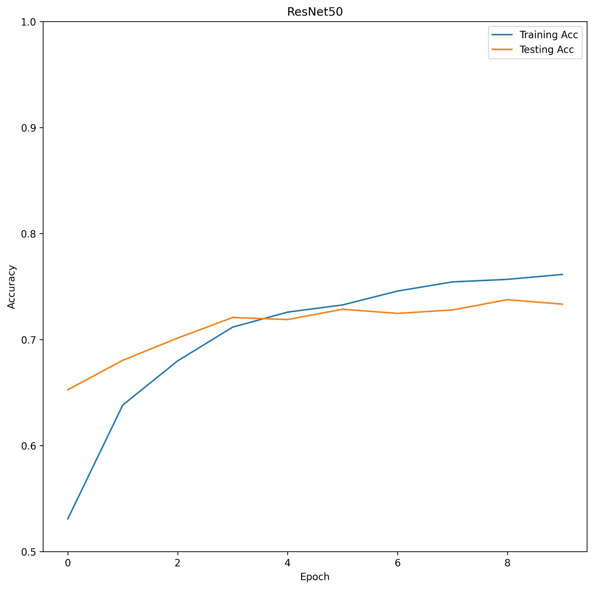
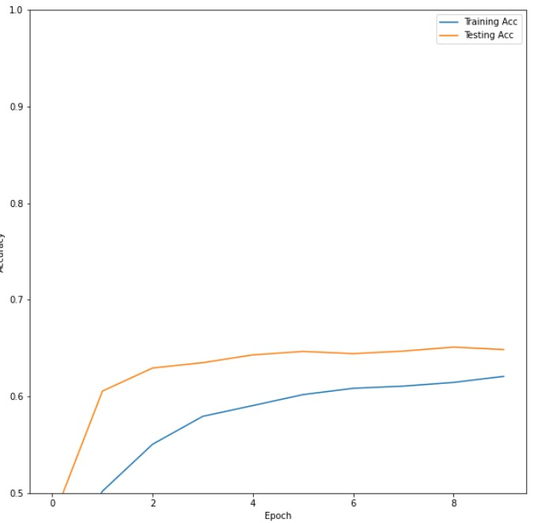
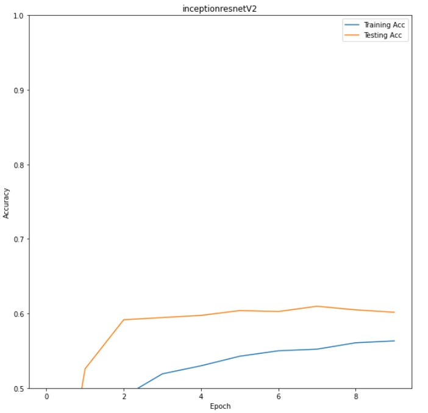
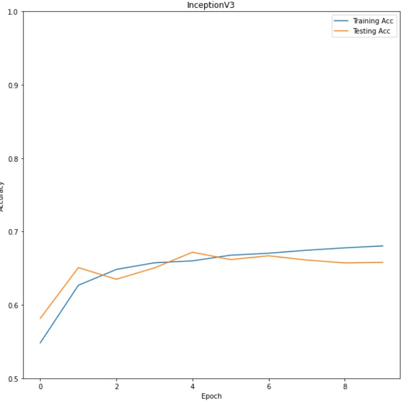

<p align="center">
  <a href="https://github.com/dhyan1999/CASIA-B-GaitAnalysis" title="Gait Analysis">
  </a>
</p>
<h1 align="center"> Gait Cycle analysis using Pattern Recognition </h1>


<p align="center">2021G COMP-5112-GDF - Research Methodolody Computer Science</p>

<h2 align="center">🌐 Links 🌐</h2>
<p align="center">
    <a href="https://github.com/dhyan1999/CASIA-B-GaitAnalysis" title="Gait Analysis">📂 Repo</a>
    ·
    <a href="https://github.com/dhyan1999/CASIA-B-GaitAnalysis/blob/main/Paper/PR_Proposal.pdf" title="Gait Analysis">📄 Paper</a>
</p>

Abstract : One of the most significant human characteristics is motion ability, which includes gait as the foundation of human transitional movement. 
Many academics had concentrated on this topic in order to consider a novel recognition system. Many human gait datasets have been developed in the previous ten years. 
The Gait Dataset of the University of South Florida (USF), the Gait Dataset of the Chinese Academy of Sciences (CASIA), and the Gait Dataset of Southampton University (SOTON) are some of the most extensively utilised datasets.
The CASIA Gait Dataset will be examined in this research to determine its properties.Gait patterns were gathered in this investigation utilising a wireless platform with two sensors attached to the individuals’ chest and right ankle.
The raw data was then subjected to certain preprocessing techniques.The performance of many temporal and frequency domain features is evaluated using five different classifiers, and a full comparison is made in this work.

## Table of Content

1. [Manifest](#-manifest)
2. [Prerequisites](#-prerequisites)
3. [ModelArchitecture](#-model-architecture)
4. [Implementation of Code](##-implementation-of-code)


## 🧑🏻‍🏫 Manifest

```
- Pre_Processing.ipynb --> A python .ipynb file that run's Pre processing of the dataset
- Resnet50.ipynb --> A python .ipynb file that run's ResNet50 Model
- Resnet152V2.ipynb --> A python .ipynb file that run's Resnet152V2 Model
- InceptionV2.ipynb --> A python .ipynb file that run's InceptionV2 Model
- InceptionV3.ipynb --> A python .ipynb file that run's InceptionV3 Model
- Paper   --> A Detailed research paper on Gait Cycle analysis using Pattern Recognition
- Requierments.txt --> A requierment file for all kind of libraries to be requiered
- README.md ---> This markdown file you are reading.
```

## 𝌭 Model Architecture

```py
x = res.output 
x = GlobalAveragePooling2D()(x)
x = BatchNormalization()(x)
x = Dropout(0.5)(x)
x = Dense(512, activation='relu')(x)
x = BatchNormalization()(x)
x = Dropout(0.5)(x)
x = Dense(3, activation='softmax')(x)

model = Model(res.input, x) 
opt = tf.keras.optimizers.RMSprop(
    learning_rate=1e-4 ,
    rho=0.9,
    momentum=0.0,
    epsilon=1e-07,
    centered=False,
    name="RMSprop"
)
model.compile(optimizer=opt, loss='categorical_crossentropy', metrics=['accuracy']) 
```

## 🤔 Prerequisites

- [Python](https://www.python.org/ "Python") Installed

- Python Basics Understanding

- Understanding of Machine Learning and Deep Learning libraries

- A deep knowledge of [Transfer Learning models](https://keras.io/api/applications/)

## 👨🏻‍💻 Implementation of Code

- Resnet50
<p>ResNet-50 is a 50-layer DCNN network and ResNet-152V2 is a 150-layer DCNN network. One may retrieve a pretrained variant of the network from the ImageNet database , which has been trained more than a million photos. The network can categorize photos into 1000 different object categories, including keyboards, mice, pencils, and a variety of animals. As a result, the network has learnt a variety of rich extracted features for a variety of pictures. The network's picture input size is 256 by 256 pixels</p>

```py
res = ResNet50(weights='imagenet', include_top=False, input_shape=(256, 256, 3))
```


- Resnet152V2

```py
res152v2 = ResNet152V2(weights='imagenet', include_top=False, input_shape=(256, 256, 3))
```


- Inceptionv2

<p>In the architecture of Inception V2, the two 3X3 convolutions replace the 5X5 convolution. Because a 5X5 convolution is 2.78 more costly than a 3X3 convolution, this reduces computing time and hence boosts computational speed. As a result, using two 3X3 layers instead of 5X5 improves architectural performance.</p>

```py
inceptionv2 = InceptionResNetV2(weights='imagenet', include_top=False, input_shape=(256, 256, 3)) 
```


- Inceptionv3

<p>Inception V3 is comparable to Inception V2 and includes all of its features, with the following alterations and additions:
The RMSprop optimizer is used.
Batch normalisation in the Auxiliary classifier's fully linked layer.
Regularization of the classifier using 7 factorised Convolution Label Smoothing Regularization: This approach estimates the influence of label-dropout during training to regularise the classifier. It stops the classifier from over-predicting a class. The addition of label smoothing improves the error rate by 0.2 percent.</p>

```py
inceptionv3 = InceptionResNetV3(weights='imagenet', include_top=False, input_shape=(256, 256, 3)) 
```



